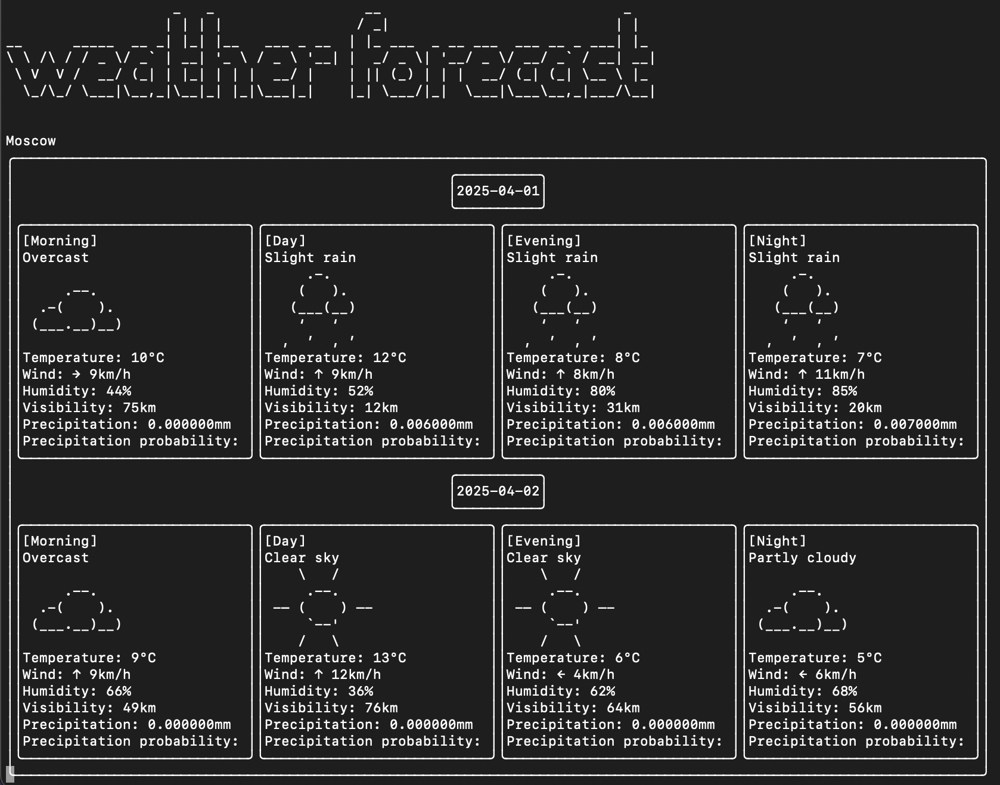

# 🌤️ Weather Forecast CLI App


A cross-platform command-line weather forecast application built with modern **C++**. The app fetches real-time weather 
data for multiple cities using external APIs and displays an elegant text-based forecast.

Users can interact with the forecast directly from the terminal using intuitive keyboard shortcuts.

---

## Features

- ⛅ Displays weather forecast for up to **16 days ahead**
- 🌍 Supports **multiple cities** with interactive switching
- 📡 Uses live weather data from [Open-Meteo API](https://open-meteo.com/)
- 🧭 Automatically fetches coordinates using [Api-Ninjas City API](https://api-ninjas.com/api/city)
- 🔃 Supports **automatic data refresh** at configurable intervals
- ⚙️ Configuration file support (`.json`, `.ini`, or `.xml`)
- 🎛️ Keyboard-controlled UI with shortcuts:
    - `n` → Next city
    - `p` → Previous city
    - `+` / `-` → Increase/decrease forecast days
    - `Esc` → Exit the program

---

## Tech Stack

| Component        | Description                                  |
|------------------|----------------------------------------------|
| **C++20**        | Core programming language                    |
| **[CPR](https://github.com/libcpr/cpr)** | HTTP client library used for making API calls |
| **nlohmann/json** _(optional)_ | For parsing configuration files in JSON format |
| **INIh/Boost.PropertyTree/TinyXML2** _(optional)_ | For `.ini` or `.xml` config file support |
| **Windows/Linux/macOS** | Fully cross-platform using only terminal I/O |

---

## Configuration File

The application is fully configurable via a config file (`config.json`, `config.ini`, or `config.xml`).  
The config contains:
- List of cities (by name)
- Default forecast days (e.g. 3, 5, or 7)
- Refresh interval in seconds (e.g. 600 for every 10 minutes)

Example (`config.json`):
```json
{
  "cities": ["Paris", "New York", "Tokyo"],
  "forecast_days": 5,
  "refresh_interval": 600
}
```

---

## Data Sources

- **Forecasts**: [Open-Meteo API](https://open-meteo.com/en/docs#latitude=59.94&longitude=30.31&hourly=temperature_2m&forecast_days=16)
- **City Coordinates**: [Api-Ninjas City API](https://api-ninjas.com/api/city)

Both services are queried via HTTPS with fallback and error-handling logic to ensure the app never crashes on bad data or connection issues.

---

## Keyboard Controls

| Key       | Action                      |
|-----------|-----------------------------|
| `n`       | Switch to next city         |
| `p`       | Switch to previous city     |
| `+`       | Show more forecast days     |
| `-`       | Show fewer forecast days    |
| `Esc`     | Exit the application        |

---

## UI

```
"cities": ["Moscow"],
"forecast_days": 2
1st April, 2025
```



---

## Error Handling

This project includes robust error handling for:
- Unreachable APIs
- Malformed responses
- Empty city lists
- Rate limiting
- Unexpected config values

The application will **never crash unexpectedly**.

---

## 🚀 Getting Started

1. Clone the repo
2. Set up dependencies (CPR, JSON/INI parsers)
3. Create your config file
4. Build the project:
```bash
mkdir build && cd build
cmake ..
make
```
5. Run the app from terminal:
```bash
./weather_app
```
